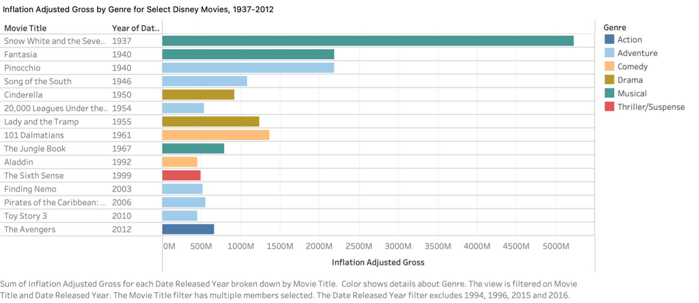
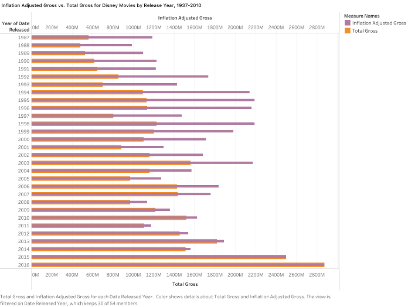
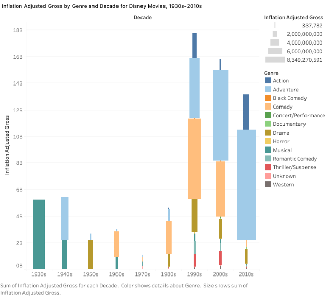

# Disney Movies Box Office Analysis — Tableau

## Overview
This project explores Disney's box office performance across genres and decades using Tableau. Three visualizations were built to analyze inflation-adjusted gross earnings from 1937 to 2016, revealing how Disney's genre strategy has evolved over nearly a century — from early animated musicals to modern action blockbusters.

**Key Question:** Which genres and eras drove Disney's box office success, and how do inflation-adjusted earnings compare to actual grosses over time?

---

## 🛠️ Tools & Technologies
- Tableau
- Excel (data preparation)

---

## 📂 Dataset
- **Source:** [Disney Movies Dataset – Kaggle](https://www.kaggle.com/datasets/suvroo/disney-movies-dataset)
- **Coverage:** Disney movies from 1937 to 2016
- **Key Fields:** Movie Title, Genre, Release Year, Total Gross, Inflation Adjusted Gross

---

## 📊 Visualizations & Key Findings

### 1️⃣ Inflation Adjusted Gross by Genre for Select Disney Movies, 1937–2012

**Key Findings:**
- Snow White and the Seven Dwarfs (1937) has the highest inflation-adjusted gross of any Disney film in the dataset — by a wide margin — reflecting how culturally dominant early Disney musicals were
- Musicals like Fantasia and Pinocchio from the 1940s were foundational to Disney's identity as an animation powerhouse
- In more recent decades, Disney has expanded successfully into action (The Avengers), adventure (Pirates of the Caribbean), and comedy (101 Dalmatians), reflecting a strategic shift toward broader, more adult-oriented blockbusters
- The chart covers selected films only, so it does not represent Disney's full output per genre

**Strengths:** Clear color coding by genre, chronological ordering, bar length makes relative grosses easy to compare

**Limitations:** Truncated movie titles, no total gross comparison, selective film coverage

---

### 2️⃣ Inflation Adjusted Gross vs. Total Gross by Release Year, 1937–2016

**Key Findings:**
- Early Disney films show the largest gap between inflation-adjusted and actual gross — Snow White, Pinocchio, and Fantasia earned far more in real terms than their nominal box office numbers suggest
- From the 1980s onward, the two bars begin to converge, reflecting lower and more stable inflation rates in recent decades
- Disney's overall box office trajectory trends upward across both metrics, demonstrating resilience and growth across economic cycles

**Strengths:** Directly compares two metrics side by side, spans the full release history, axes and legend are clearly labeled

**Limitations:** Dense with data points, making individual year trends harder to read; no genre breakdown

---

### 3️⃣ Inflation Adjusted Gross by Genre and Decade, 1930s–2010s

**Key Findings:**
- Musicals dominated Disney's box office in the 1930s and 1940s, driven by the success of early animated features
- Adventure films have been the most consistent genre across all decades from the 1950s through the 2010s, reflecting the enduring appeal of Disney's family-friendly adventure formula
- The 1990s and 2000s mark a turning point — Disney's genre mix diversifies significantly, with comedy, drama, and action all contributing substantial inflation-adjusted grosses alongside adventure
- The 2010s show strong action performance, driven by Marvel acquisitions

**Strengths:** Combines genre, decade, and gross in a single stacked view; bar size intuitively represents total decade performance; legend includes specific gross values

**Limitations:** Smaller genres (e.g. Thriller/Suspense, Horror) are difficult to distinguish; no exact per-genre values labeled; color scheme may present accessibility issues for colorblind viewers

---

## Conclusion
Disney's box office history reveals a clear strategic evolution. The studio built its foundation on animated musicals in the 1930s–1940s, sustained growth through adventure films across all decades, and diversified aggressively into action and comedy from the 1990s onward. The gap between inflation-adjusted and nominal gross earnings is most pronounced for early films, underscoring just how dominant those releases were in their economic context. Together, these three visualizations illustrate how Disney has consistently adapted its genre strategy to remain a box office leader across nearly 90 years.

---

## References
Suvroo. (2024, September 13). *Disney movies dataset*. Kaggle. https://www.kaggle.com/datasets/suvroo/disney-movies-dataset
